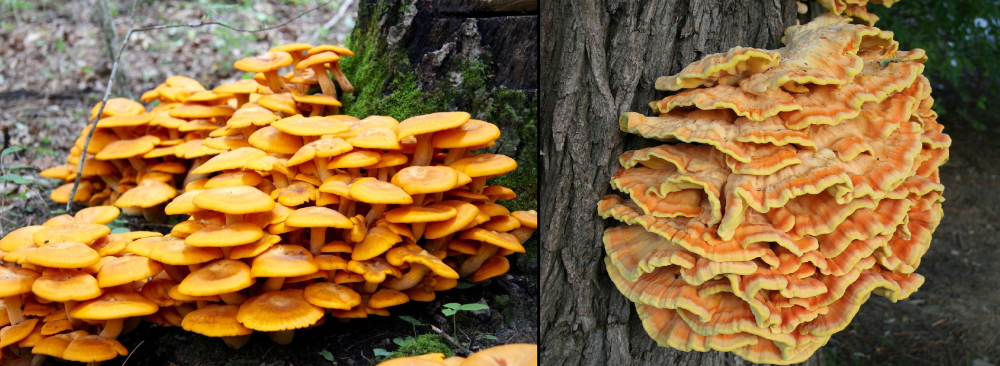

```{r setup, include=FALSE}

if(!require(tidyverse)) install.packages("tidyverse")
if(!require(caret)) install.packages("caret")
if(!require(gridExtra)) install.packages("gridExtra")
if(!require(knitr)) install.packages("knitr")

library(tidyverse)
library(caret)
library(gridExtra)
library(knitr)


# Load the cached data if available, otherwise run the full source code.
dataFile <- "prediction_data.RData"
if (file.exists(dataFile)) {
  load(dataFile)
} else {
  source("capstone_project.R")
  save(
  mushroom_data_has_nulls,
  mushroom_data,
  final_test_data,
  plots,
  cm_simple,
  cm_glm,
  cm_knn,
  cm_rf,
  cm_final_glm,
  cm_final_knn,
  cm_final_rf,
  glm_imp,
  knn_imp,
  rf_imp,
  jack_o_lantern,
  y_hat_glm_jol,
  y_hat_knn_jol,
  y_hat_rf_jol,
  file = "prediction_data.RData")
}
```

# Introduction
Mushrooms are an important part of the natural ecosystem by playing a role in the decomposition of organic matter. They are also significant to human culinary traditions as well as other traditions such as medicine. However, not all mushrooms are safe to consume where certain species can be deadly if ingested. Accurately classifying mushrooms can be a literal life or death situation, therefore properly classifying mushrooms is important for foragers.

The goal of this project is to develop a machine learning model that can classify mushrooms as either edible or poisonous based on a set of attributes. The dataset utilized was contributed to the University of California, Irvine (UCI) machine learning repository in 1987 and is licensed under the CC0: Public Domain. The dataset was sourced from [[Kaggle.com]](#dataset-source). The analysis is performed on 21 of the 22 attributes as the data provided was constant for "veil-type". The analysis is conducted with R 4.4.1. The dataset abbreviates each of the categories in a feature such as using "n" for "none". The full definition of the mushroom attributes is included in the [reference section](#mushroom-attributes).

\pagebreak
# Data Analysis

## Data Cleaning
The dataset is already well-structured and clean requiring very little preprocessing to prepare it for the machine learning process. Before moving forward with the analysis, the dataset was examined for missing or invalid values. The `is.na()` function checks for null entries in the dataset.

```{r, eval=FALSE}
mushroom_data_has_nulls <- any(is.na(mushroom_all_data))
```
`mushroom_data_has_nulls` = `r mushroom_data_has_nulls`

The data does not have any nulls. However, one of the columns is named "class" which is a reserved keyword. To prevent issues, "class" will be renamed to "class_label".

```{r, eval=FALSE}
names(mushroom_all_data)[names(mushroom_all_data) == "class"] <- "class_label"
```

Finally, to properly test the final machine learning models, a portion of the dataset will be reserved in the variable `final_test_data`.

```{r, eval=FALSE}
set.seed(987)
splitInd <- createDataPartition(mushroom_all_data$class_label, p=0.7, list=FALSE)
mushroom_data <- mushroom_all_data[splitInd, ]
final_test_data <- mushroom_all_data[-splitInd, ]
```

\pagebreak
## Data Exploration and Visualization
The mushroom dataset has 21 features that can be used to help classify whether the mushroom is edible or poisonous. To begin exploring the data, a plot of each attribute and their values grouped by classification is created to look for patterns.

```{r fig1, echo=FALSE, fig.align='center', fig.cap="Figure 1: All Attributes by Classification", fig.height=8.4, fig.width=7, out.width='100%'}
long_data <- pivot_longer(mushroom_data, cols = everything(),
                          names_to = "variable", values_to = "value")

plots <- lapply(unique(long_data$variable), function(feature) {
  mushroom_data %>%
  select(all_of(feature), class_label) %>%
  ggplot(aes(x = !!sym(feature), fill = class_label)) +
  geom_bar(position = "dodge") +
  scale_fill_manual(
    values = c("e" = "steelblue", "p" = "darkred"),
    labels = c("e" = "e", "p" = "p")
  ) +
  labs(title = feature, x = feature, y = "Count") +
  theme_minimal(base_size = 8) +
  theme(
    plot.title = element_text(size = 9, face = "bold"),
    axis.title = element_text(size = 8),
    axis.text = element_text(size = 7),
    legend.title = element_text(size = 7),
    legend.text = element_text(size = 6),
    legend.key.size = unit(0.3, "cm"),
    legend.spacing = unit(0.1, "cm"),
    legend.margin = margin(0, 0, 0, 0),
    legend.box.margin = margin(0, 0, 0, 0),
    axis.text.x = element_text(angle = 45, hjust = 1)
  )
})

# Arrange the plots in a grid layout
grid.arrange(grobs = plots, ncol = 3)
```

One of the features stand out more than the rest: "odor".
```{r fig2, echo=FALSE, fig.align='center', fig.cap="Figure 2: Mushroom Classification by Odor"}
mushroom_data %>%
  select(odor, class_label) %>%
  ggplot(aes(x=odor, fill = class_label)) +
  geom_bar(position="dodge") +
  scale_fill_manual(
    values = c("e" = "steelblue", "p" = "darkred"),
    labels = c("e" = "edible", "p" = "poisonous")
  ) +
  labs(title = "Mushroom Classification by Odor", x = "Odor", y = "Count")
```

The mushroom "odor" is almost entirely segregated with only a slight amount of overlap in the "n" or "none" category. This can serve as the basis of a simple model to classify mushrooms by only odor. There are other features that stand out, such as "spore-print-color", but they have more overlap than "odor" making it less appealing for a simple model. However, those features may have a higher level of importance in the machine learning models.

\pagebreak
## Model Development Process

### Test and Train Datasets

To train the models, the data is split into training and testing sets. To prevent overfitting, each iteration of the model will use a different set of training and testing data selected using a random seed and the `createDataPartition` method. The following steps are performed for all models with varying seeds as shown:

```{r, eval=FALSE}
set.seed(100, sample.kind="Rounding")
trainIndex <- createDataPartition(mushroom_data$class_label, p=0.8, list=FALSE)
train <- mushroom_data[trainIndex,]
test <- mushroom_data[-trainIndex,]
```

where `train` is the larger dataset used to train the model and `test` is used to validate the model's accuracy.

### Simple Model Using Odor

A simple model is built using the "odor" feature, classifying the mushrooms based on whether their odor belongs to certain categories. A simple if-else statement is used for this model.

```{r, eval=FALSE}
y_hat_simple <- factor(
  ifelse(mushroom_data$odor %in% c("a", "l", "n"), "e", "p"),
  levels = levels(mushroom_data$class_label))
cm_simple <- confusionMatrix(y_hat_simple, mushroom_data$class_label)
```

The simple model achieves a surprisingly high accuracy of `r round(cm_simple$overall['Accuracy']*100, 2)`%. With this baseline, more advanced machine learning algorithms can be applied.

### Generalized Linear Model (GLM)

GLM is used to model the relationship between mushroom features and their class with a linear approach.

```{r, eval=FALSE}
set.seed(123)
trainIndex <- createDataPartition(mushroom_data$class_label, p=0.8, list=FALSE)
train_data <- mushroom_data[trainIndex, ]
test_data <- mushroom_data[-trainIndex, ]

fit_glm <- train(class_label ~ ., data = train_data, method = "glm",
                 trControl = trainControl(method = "cv"))
y_hat_glm <- predict(fit_glm, newdata = test_data)
cm_glm <- confusionMatrix(y_hat_glm, test_data$class_label)
```

The GLM model has an accuracy of `r round(cm_glm$overall['Accuracy']*100, 2)`%. This indicates that the dataset is well-suited for a linear approach when predicting the mushroom's classification. In this situation, perfect accuracy raises concerns about the dataset's suitability for generalization. The dataset may be too narrowly cultivated to be useful outside of this specific mushroom dataset. Further investigation is needed to assess the models limitations and explore if it can be applied to other data.

\pagebreak
### k-Nearest Neighbors (KNN)

KNN classifies mushrooms based on their nearest neighbors in the feature space. The following approach is used to implement a KNN model:

```{r, eval=FALSE}
set.seed(456)
trainIndex <- createDataPartition(mushroom_data$class_label, p=0.8, list=FALSE)
train_data <- mushroom_data[trainIndex, ]
test_data <- mushroom_data[-trainIndex, ]

fit_knn <- train(class_label ~ ., data = train_data, method = "knn",
                 trControl = trainControl(method = "cv"))
y_hat_knn <- predict(fit_knn, newdata = test_data)
cm_knn <- confusionMatrix(y_hat_knn, test_data$class_label)
```

The KNN model has an accuracy of `r round(cm_knn$overall['Accuracy']*100, 2)`%. Like the GLM model, the KNN model boasts perfect accuracy. Again, the high accuracy is a concern for overfitting or dataset limitations.

### Random Forest (RF)
Random Forest creates multiple decision trees to classify mushrooms, combining their predictions for improved accuracy. The RF model implementation:

```{r, eval=FALSE}
set.seed(789)
trainIndex <- createDataPartition(mushroom_data$class_label, p=0.8, list=FALSE)
train_data <- mushroom_data[trainIndex, ]
test_data <- mushroom_data[-trainIndex, ]

fit_rf <- train(class_label ~ ., data = train_data, method = "rf",
                trControl = trainControl(method = "cv"))
y_hat_rf <- predict(fit_rf, newdata = test_data)
cm_rf <- confusionMatrix(y_hat_rf, test_data$class_label)
```

The random forest model has an accuracy of `r round(cm_rf$overall['Accuracy']*100, 2)`%. The random forest model doesn't quite reach perfect accuracy, but its performance is still strong.

\pagebreak
# Results

## Final Test Data

Each of the trained models are evaluated on the `final_test_data` set to determine their performance and accuracy for unseen observations.

```{r, eval=FALSE}
y_hat_final_glm <- predict(fit_glm, newdata = final_test_data)
cm_final_glm <- confusionMatrix(y_hat_final_glm, final_test_data$class_label)

y_hat_final_knn <- predict(fit_knn, newdata = final_test_data)
cm_final_knn <- confusionMatrix(y_hat_final_knn, final_test_data$class_label)

y_hat_final_rf <- predict(fit_rf, newdata = final_test_data)
cm_final_rf <- confusionMatrix(y_hat_final_rf, final_test_data$class_label)
```

The results can be combined and displayed in a tabular format:
```{r}
model_accuracies <- tibble(
  Model = c("GLM", "KNN", "Random Forest"),
  Accuracy = c(
    round(cm_final_glm$overall["Accuracy"] * 100, 2),
    round(cm_final_knn$overall["Accuracy"] * 100, 2),
    round(cm_final_rf$overall["Accuracy"] * 100, 2)
  ))

kable(model_accuracies,
      col.names = c("Model", "Accuracy (%)"),
      caption = "Final Test Set Accuracy by Model")
```

All three models maintained a near-perfect prediction accuracy on the final test set, but the consistently high accuracy also raises concerns about real-world applicability. The dataset could be too clean or simplistic which would hinder its abilities beyond the specific types of mushrooms that are contained in the dataset.

\pagebreak
## Variable Importance
For each of the models, the features that influence the results the most can be retrieved. The following code will perform some preprocessing to make the results consistent with each other and pull out the top 5 most important features.

```{r, eval=FALSE}
var_imp_glm <- varImp(fit_glm)
var_imp_knn <- varImp(fit_knn)
var_imp_rf <- varImp(fit_rf)

glm_imp <- var_imp_glm$importance %>% 
  rownames_to_column("Variable") %>%
  arrange(desc(Overall)) %>%
  slice(1:5) %>%
  mutate(Model = "GLM")

knn_imp <- var_imp_knn$importance %>% 
  rownames_to_column("Variable") %>%
  select(Variable, Overall = 2) %>%
  arrange(desc(Overall)) %>%
  slice(1:5) %>%
  mutate(Model = "KNN")

rf_imp <- var_imp_rf$importance %>% 
  rownames_to_column("Variable") %>%
  arrange(desc(Overall)) %>%
  slice(1:5) %>%
  mutate(Model = "Random Forest")
```

With the data in similar formats, it can be combined and plotted as bar graphs versus its importance score.

```{r, echo=FALSE, fig.align='center', fig.cap="Figure 3: Variable Importance per Model"}
combined_imp <- bind_rows(glm_imp, knn_imp, rf_imp)

ggplot(combined_imp, aes(x = reorder(Variable, Overall),
                         y = Overall, fill = Model)) +
  geom_bar(stat = "identity", position = "dodge") +
  coord_flip() +
  labs(
    title = "Top 5 Most Important Variables per Model",
    x = "Variable",
    y = "Importance Score"
  ) +
  scale_fill_manual(values = c("GLM" = "steelblue",
                               "KNN" = "orange",
                               "Random Forest" = "darkgreen"))
```

Interestingly, every model considered a different feature:

  - Random forest relied on mushrooms not having any discernible odor.
  - KNN utilized the gill-color of the mushroom as its most important predictor.
  - GLM focused on the spore print color of green.

Even among the remaining four features, the models have very little overlap. This indicates that multiple strong predictive paths exist in this dataset. Depending on the available data or modeling approach, various subsets of mushroom features can still yield highly accurate classifications.

\pagebreak
# Model Limitations and Testing Edge Cases

While the models performed exceptionally well for the provided dataset, the perfect or near perfect performance may not be able to predict more generalized data. It's important to explore the model's limitations and test edge cases, especially when the prediction can result in a possible life or death situation.

## The "Jack-O-Lantern" Test
To assess how the models handle unfamiliar inputs, a synthetic mushroom was created based on the known features of the *Jack-O'-Lantern* mushroom ([references](#jack-o-lantern-mushroom)). The Jack-O-Lantern mushroom is an actual poisonous species not represented in the dataset. Its appearance could be mistaken by amateur foragers for "Chicken of the Woods", a highly sought after edible mushroom. This "Jack-O'-Lantern" mushroom was created using the same features as the dataset and run through each model to evaluate their predictions.


\begin{center}
Figure 4: Jack-O-Lantern's (left) similarity to Chicken of the Woods (Right)
\end{center}

\pagebreak
```{r, eval=FALSE}
jack_o_lantern = data.frame(
  `class_label`="p",
  `cap-shape` = "c",
  `cap-surface` = "s",
  `cap-color` = "y",
  `bruises` = "FALSE",
  `odor` = "n",
  `gill-attachment` = "a",
  `gill-spacing` = "c",
  `gill-size` = "b",
  `gill-color` = "y",
  `stalk-shape` = "t",
  `stalk-root` = "c",
  `stalk-surface-above-ring` = "s",
  `stalk-surface-below-ring` = "s",
  `stalk-color-above-ring` = "o",
  `stalk-color-below-ring` = "o",
  `veil-color` = "o",
  `ring-number` = "o",
  `ring-type` = "e",
  `spore-print-color` = "w",
  `population` = "c",
  `habitat` = "d",
  check.names = FALSE
)

y_hat_glm_jol <- predict(fit_glm, newdata=jack_o_lantern)
y_hat_knn_jol <- predict(fit_knn, newdata=jack_o_lantern)
y_hat_rf_jol <- predict(fit_rf, newdata=jack_o_lantern)
```

```{r}
predictions <- tibble(
  Model = c("GLM", "KNN", "Random Forest"),
  Classification = c(y_hat_glm_jol, y_hat_knn_jol, y_hat_rf_jol))

kable(predictions,
      col.names = c("Model", "Classification"),
      caption = "Jack-O-Lantern Model Predictions")
```

All three models incorrectly classified the Jack-O-Lantern mushroom as edible. This indicates a major limitation: the models struggle with more generalized data beyond their training scope. These results reinforce that using models like these in the real world as a primary means of analysis can lead to severe consequences, including death.

## Model Accuracy Across Different Habitats
To further illustrate how the training scope can affect the results, the following examples will utilize the woods and grassland mushrooms from the dataset. A GLM model will be trained on the woods mushrooms and then used to predict the classification of the grassland mushrooms.

```{r, warning=FALSE, message=FALSE}
woods_mushrooms <- mushroom_data %>% filter(habitat == "d")
grass_mushrooms <- mushroom_data %>% filter(habitat == "g")

# Train on woods, test on grass
fit_woods <- train(class_label ~ ., data = woods_mushrooms, method = "glm",
                    trControl = trainControl(method = "cv"))
y_hat_grass <- predict(fit_woods, newdata = grass_mushrooms)
cm_grass <- confusionMatrix(y_hat_grass, grass_mushrooms$class_label)
```

The woods mushroom based model achieved an accuracy of `r cm_grass$overall['Accuracy']` when used to predict the classification of grassland mushrooms. This is much lower than the simple model used previously but for mushroom classification, the false positive rate (FPR) is most important since it incorrectly describes a poisonous mushroom as edible.

```{r}
FP <- cm_grass$table["e", "p"]
TN <- cm_grass$table["p", "p"]
FPR <- FP / (FP + TN)
```

This model results in a dangerously high FPR of `r round(FPR*100, 2)`%. That's nearly 1 in 4 mushrooms that are classified as edible that were actually poisonous.

# Conclusion

This project explored the development of machine learning classification models to determine whether a mushroom is edible or poisonous based on its features. The model's near-perfect accuracy revealed more about the dataset's specificity than its ability to generalize to all mushrooms. Through variable importance analysis, it was found that each model focused on different features suggesting that there are several ways within the dataset to classify the mushrooms. This seems promising on the surface but it also suggests that the models are overfitted to this specific dataset rather than training on more generalized insights. The "Jack-O-Lantern" test case as well as the woods vs. grassland mushroom test cases further demonstrates that the models were very narrow in scope which could lead to disastrous real world results from misclassification. While the models performed exceptionally on the curated data, they should not be relied upon in isolation for a real-world mushroom identification. Future work could incorporate broader datasets including things such as country, region, weather conditions, etc.. along with a subject matter expert to help hone the models for more generalized use.

\pagebreak
# Reference

## Mushroom Attributes

| **Attribute**          | **Values**                                                                                                     |
|------------------------|----------------------------------------------------------------------------------------------------------------|
| **Class**              | e (edible), p (poisonous)                                                                                      |
| **Cap Shape**          | b (bell), c (conical), x (convex), f (flat), k (knobbed), s (sunken)                                           |
| **Cap Surface**        | f (fibrous), g (grooves), y (scaly), s (smooth)                                                                |
| **Cap Color**          | n (brown), b (buff), c (cinnamon), g (gray), r (green), p (pink), u (purple), e (red), w (white), y (yellow)   |
| **Bruises**            | t (bruises), f (no)                                                                                            |
| **Odor**               | a (almond), l (anise), c (creosote), y (fishy), f (foul), m (musty), n (none), p (pungent), s (spicy)          |
| **Gill Attachment**    | a (attached), d (descending), f (free), n (notched)                                                            |
| **Gill Spacing**       | c (close), w (crowded), d (distant)                                                                            |
| **Gill Size**          | b (broad), n (narrow)                                                                                          |
| **Gill Color**         | k (black), n (brown), b (buff), h (chocolate), g (gray), r (green), o (orange), p (pink), u (purple), e (red), w (white), y (yellow) |
| **Stalk Shape**        | e (enlarging), t (tapering)                                                                                    |
| **Stalk Root**         | b (bulbous), c (club), u (cup), e (equal), z (rhizomorphs), r (rooted), ? (missing)                            |
| **Stalk Surface Above**| f (fibrous), y (scaly), k (silky), s (smooth)                                                                  |
| **Stalk Surface Below**| f (fibrous), y (scaly), k (silky), s (smooth)                                                                  |
| **Stalk Color Above**  | n (brown), b (buff), c (cinnamon), g (gray), o (orange), p (pink), e (red), w (white), y (yellow)              |
| **Stalk Color Below**  | n (brown), b (buff), c (cinnamon), g (gray), o (orange), p (pink), e (red), w (white), y (yellow)              |
| **Veil Color**         | n (brown), o (orange), w (white), y (yellow)                                                                   |
| **Ring Number**        | n (none), o (one), t (two)                                                                                     |
| **Ring Type**          | c (cobwebby), e (evanescent), f (flaring), l (large), n (none), p (pendant), s (sheathing), z (zone)           |
| **Spore Print Color**  | k (black), n (brown), b (buff), h (chocolate), r (green), o (orange), u (purple), w (white), y (yellow)        |
| **Population**         | a (abundant), c (clustered), n (numerous), s (scattered), v (several), y (solitary)                            |
| **Habitat**            | g (grasses), l (leaves), m (meadows), p (paths), u (urban), w (waste), d (woods)                               |

\pagebreak
## Figure Code

### Figure 1 Code

```{r ref.label="fig1", eval=FALSE}
```

### Figure 2 Code

```{r ref.label="fig2", eval=FALSE}
```

\pagebreak
## External References
The following are references that assisted in creating this rmarkdown file used to generate both the html and pdf documents.

### Dataset Source
The mushroom data was sourced from Kaggle:
https://www.kaggle.com/datasets/uciml/mushroom-classification


### Jack-O-Lantern Mushroom
The following sources were utilized to gather the Jack-O-Lantern's attributes.

1. https://www.mushroomexpert.com/omphalotus_olearius.html
2. https://www.mushroom-appreciation.com/omphalotus-olearius.html
3. https://en.wikipedia.org/wiki/Omphalotus_olearius

### PDF Figure Position Fix
Figures that could not fit on the remainder of a pdf page would be pushed to the next page. However, the text that followed the figures would be placed on the prior page above the image. This rearrangement created a difference in the output between the html and pdf formats. The below forum post provided the answer to ensure the figures remained in the same locations as defined in the rmarkdown file.

https://forum.posit.co/t/cant-control-position-of-tables-and-figures-in-knitted-pdf-document/37364


